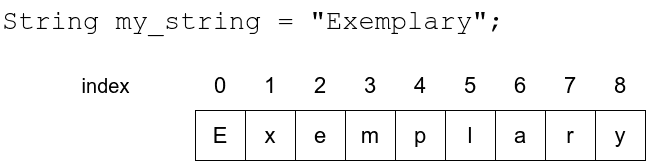
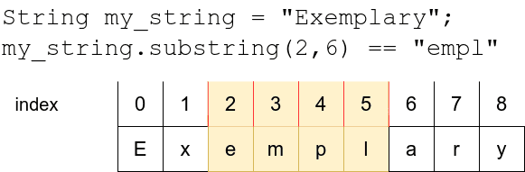

# Working with strings

<!--toc:start-->
- [Working with strings](#working-with-strings)
  - [Learning objectives](#learning-objectives)
  - [Operations](#operations)
  - [Length and index of a string](#length-and-index-of-a-string)
<!--toc:end-->

## Learning objectives

- Be able to use `+` and `*` operators with strings.
- Find out the length of a string.
- Learn what **string indexing** is.
- How to look for *substrings* withing a string.

## Operations

String can be concatenated with the `+` operator:

```python
begin = "ex"
end = "ample"
word = begin+end
print(word)
# example
```

Also, the `*` operator can be used in this way when the other operand
is an integer. The string operand is then repeated the number of
times specified by the integer.

```python
word = "banana"
print(word*3)
# bananabananabanana
```

## Length and index of a string

The `len` function returns the number of characters in a string, this value
is an integer always. For example:

```python
print(len("hey"))
# 3
```

Other example using operators:

```python
input_string = input("Please type in a string: ")
print(input_string)
print("-"*len(input_string))
#Hi there!
#---------
```

As strings are essentially sequences of characters, any single
character in a string can also be retrieved. The operator []
finds the character with the index specified within the brackets.

The index refers to a position in the string, counting up from zero.
The first character in the string has index 0, the second character
has index 1, and so forth.



The following program loops through all the characters in a string
from first to last:

```python
input_string = input("Please type in a string: ")
index = 0
while index < len(input_string):
    print(input_string[index])
    index += 1
```

## Substrings and slices

A *substring* is **sequence** of characters within a string. *Slicing* a
string refers to selecting this sequences, and a *slice* refers
to a substring. There's the notation `[a:b]` for slicing a string.
This means a slices beginning at index `a`  and ending **before**
the index `b`, that is, including the first, but excluding the last.


In code this looks like this:

```python
input_string = "presumptious"

print(input_string[0:3])
# pre
print(input_string[4:10])
# umptio

# if the beginning index is left out, it defaults to 0
print(input_string[:3])
# pre

# if the end index is left out, it defaults to the length of the string
print(input_string[4:])
# umptius

```

## Searching substrings

The `in`  operator can tell us if a string contains a particular substring.
The Boolean expression `a in b`  is true, if `b`  contains the substring `a`.

For example, this bit of code:

```python
input_string = "test"

print("t" in input_string) # true
print("x" in input_string) # false
print("es" in input_string) # true
print("ets" in input_string) # false

```

> [!NOTE]
> The [vowes](./12_vowels.py) is very illustrative about this *substrings*
topic and the model's answer it's clever.

## The `find` method in strings

While the operator `in` returns `True` as Boolean vale **if**
a given substring exist within a string, it does not tell us
**where** it actually is. This is when the `find` string method
comes in handy. It takes the substring searched for as an argument,
and returns either the first index where it is found, or `-1`
if the substring is not found within the string.

```python
input_string = "test"

print(input_string.find("t")) # 0
print(input_string.find("x")) # -1
print(input_string.find("es")) # 1
print(input_string.find("ets")) # -1

```

A more complex example using a loop and input:

```python
input_string = "perpendicular"

while True:
    substring = input("What are you looking for? ")
    index = input_string.find(substring)
    if index >= 0:
        print(f"Found it at the index {index}")
    else:
        print("Not found")
```

> [!IMPORTANT]
> **Methods**  differentiate from functions in the fact that
methods always are attached to the *object* it is called on.
In the case of `find` the object is the **string** where
the method *looks for* the substring.
