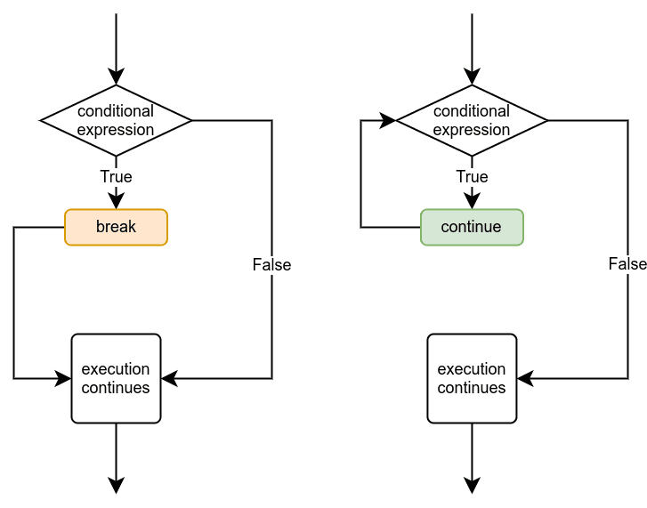

# More loops

## Learning objectives

- Understand when the `break` command it's needed.
- Implement `continue` to move to the next iteration.
- Understand how **nested** loops works.

## Break and continue commands

As we've seen in other lessons, the `break` command helps
when we need to end the execution of a loop. Of course this
is not the only way to terminate a loop, in previous exercises
we used conditions, when they are met by the program, the loop
stops:

```python
sum = 0
number = 0

while number != -1:
    number = int(input("Please type in a number, -1 to exit: "))
    if number != -1:
        sum += number

print (f"The sum is {sum}")

```

The same functionality can be reached with different approach:

```python
sum = 0

while True:
    number = int(input("Please type in a number, -1 to exit: "))
    if number == -1:
        break
    sum += number

print (f"The sum is {sum}")

```

### Continue command

As `break`, the `continue` command modify the way a loop is executed:
it causes the execution of the loop to jump straight to the beginning
of the loop, where the condition of the loop is.



For example, the following program uses both commands to achieve
a kind of *filtering* values from input:

```python
sum = 0

while True:
  number = int(input("Please type in a number, -1 to exit."))
  if number == -1:
    break
  if number >= 10: # loop restarts if the condition is met.
    continue
  sum += 1

print(f"The sum is {sum}")

```

## Nested loops

Loops can be nested as other kids of executions —such as the if - else
blocks; for example, the following program uses a loop to ask the user
to input numbers. It then uses another loop inside the first one to print
a countdown from the given number down to 1:

```python
while True:
    number = int(input("Please type in a number: "))
    if number == -1:
        break
    while number > 0:
        print(number)
        number -= 1
```

## Helper variables with loops

We've already used helper variables, which increase or decrease with every
iteration of a loop, many times before, so the following program should
look quite familiar in structure. The program prints out all even numbers
above zero until it reaches a limit set by the user:

```python
limit = int(input("Please type in a number: "))
i = 0
while i < limit:
    print(i)
    i += 2
```

Using nested loops sometimes necessitates a separate helper variable for
the inner loop. The program below prints out a "number pyramid" based on
a number given by the user:

```python
number = int(input("Please type in a number: "))
while number > 0:
    i = 0
    while i < number:
        print(f"{i} ", end="")
        i += 1
    print()
    number -= 1
```

In this program, the first **helper variable** is `number`, which is being
decreased each iteration until it reaches 0. The second is variable `i`,
which is set to zero every iteration of the *outer loop*. The inner loop
uses this variable increasing it by 1 every time. This repeats until
variable `i` is equal to `number`, printing each value of `i` in the same
line —this is achieve by the `end=""` parameter on the print function.
As the `number` variable gets decreased, also does the times the inner loop
executes.
