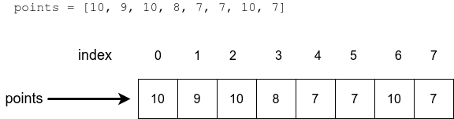

# Lists in python

## Learning objectives

- Learn what **lists** are in python.
- Learn to access specific items in lists.
- Know how to add and remove items from lists.
- Become familiar with lists functions and methods.

## Introduction

We've been using individual variables to store and use data,
but this approach can get inefficient when a lot a data has
to be handled.

A python **list** is a *collection of values* which can be accessed
with a single variable name. A list is represented with
**squared brackets**, and inside it are the **items** or elements
of the list.

```python
# A list of numbers
my_list = [1,2,3,4,5]
```

## Accessing items in a list

The items of a given list are indexed as the characters in a
string are: starts at 0 and the last item is -1:



Accessing items of a list works similarly as in strings:

```python

my_list = [7, 2, 2, 5, 2]

print(my_list[0]) # 7
print(my_list[1]) # 2
print(my_list[3]) # 5

print("The sum of the first two items:", my_list[0] + my_list[1])
# Output:
# The sum of the two items: 9

```

All the contents —which is the list itself— can be printed all at
once:

```python
my_list = [7, 2, 2, 5, 2]
print(my_list)

# Output:
# [7, 2, 2, 5, 2]

```

One important different to take in mind, is that list are **mutable**
which means its contents can change, unlike strings. As variables,
we can assign new values:

```python

my_list = [7, 2, 2, 5, 2]
print(my_list) # [7, 2, 2, 5, 2]
my_list[1] = 3
print(my_list) # [7, 3, 2, 5, 2]

```

In the case of lists, the function `len()` returns the *number of
items* in the list.

```python

my_list = [7, 2, 2, 5, 2]
print(len(my_list)) # 5

```

## Adding items to a list

There is the `.append()` method which adds items **at the end** of
the list:

```python

numbers = [] # create an empty list
numbers.append(5)
numbers.append(10)
print(numbers)
# Output
# [5, 10]

```

> [!NOTE]
> The item is appended to the list on which the method is called.

### Adding to specific locations

There is an alternative to the `.append()` method seen above that allow
to *to specify a location* in the list where we want to add the items.
This can be done with the `.insert()` method. It requires the index
where the data will be inserted, and the data itself:

```python

numbers = [1, 2, 3, 4, 5, 6]
numbers.insert(0, 10)
print(numbers) # [10, 1, 2, 3, 4, 5, 6]
numbers.insert(2, 20)
print(numbers) # [10, 1, 20, 2, 3, 4, 5, 6]

```

## Removing items from list

Two methods allow us to remove items from lists:

- The `.pop()` method receives the ***index**  of the item*  you want to remove.
It also **returns**  the *removed item*.
- The `.remove()` method receives the ***value**  of the item*  to remove.
It removes the ***first** occurrence* of the item.

Let's see the `.pop()` method in action first:

```python

my_list = [1, 2, 3, 4, 5, 6]

my_list.pop(2)
print(my_list) # [1, 2, 4, 5, 6]
my_list.pop(3)
print(my_list) # [1, 2, 4, 6]
print(my_list.pop(0)) # 1

```

> [!NOTE]
> The `.pop()`method **returns** the removed item.

Now let's check the `.remove()` method:

```python

my_list = [1, 2, 3, 4, 5, 6]

my_list.remove(2)
print(my_list) # [1, 3, 4, 5, 6]
my_list.remove(5)
print(my_list) # [1, 3, 4, 6]

```

> [!NOTE]
> The `.remove()`method causes an error if the value is
not in the list.

To avoid errors when the value is non existent in the list
we can check if it actually is in the list using the `in`
operator:

```python

my_list = [1, 3, 4]

if 1 in my_list:
    print("The list contains item 1")

if 2 in my_list:
    print("The list contains item 2")

# Output:
# The list contains item 1

```

## Sorting lists

Sorting the items of lists can be done in two different ways:

1. Modifying the list it itself with the method `.sort()`.

```python

numbers = [2, 3, 1]
numbers.sort()
print(numbers) # [1, 2, 3]

```

1. Creating a copy of the list with the function `sorted()`.

```python

numbers = [2, 1, 4, 3]
ordered = sorted(numbers)
print(ordered)

```

> [!IMPORTANT]
> Note that function `sorted()` returns a copy of the list,
so we are able to store it in a new variable; where the
method `.sort()` applies directly to the list itself.

## Maximum, minimum and sum

These are three handy functions when we're working with
lists, very straightforward:

- The function `max()` returns the greatest value in the list.
- The function `min()` returns the smallest value.
- Finally, the `sum()` function returns the sum of all items.

```python

my_list = [5, 2, 3, 1, 4]

greatest = max(my_list)
smallest = min(my_list)
list_sum = sum(my_list)

print("Smallest:", smallest) # Smallest: 1
print("Greatest:", greatest) # Greatest: 5
print("Sum:", list_sum) # Sum: 15

```

## Methods vs functions

As we saw previously, the methods use the dot `.` operator,
like `.append()` or `.sort()`. On the other hand, functions
are able to receive —sometimes— lists as arguments, just
like `sorted()` or `len()`.

## List as an argument

> [!CAUTION]
> The **index** of the list always must be an **integer** value.

Just like we saw above, functions can use lists as
arguments, therefore, our own functions also can, also
they can produce lists as return values:

```python

def median(my_list: list):
    ordered = sorted(my_list)
    list_centre = len(ordered) // 2
    return ordered[list_centre]

```

> [!IMPORTANT]
> Functions help us to divide in small and logical
pieces to build are hole program. This is the main
reasons to learn to use functions and how the can
work together.

One more complex example:

```python

def input_numbers():
    numbers = []
    while True:
        user_input = input("Please type in an integer, leave empty to exit: ")
        if len(user_input) == 0:
            break
        numbers.append(int(user_input))
    return numbers

```

Organizing the code in functions improves its readability, making
easier to handle the whole logic of the program. It also makes the
code **reusable** when you need to apply some functionality
multiple times.
