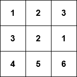

# More lists

## Learning objectives

Create lists with different types of items.
Learn how to use lists to organize data.
Be able to store a matrix as two-dimensional list.

## Lists with different type of data

In the previous part we mainly handled lists with integer items, but any types
of values can be stored in lists. A list of strings could look like this:

```python

names = ["Marlyn", "Ruth", "Paul"]
print(names)
names.append("David")
print(names)

print("Number of names on the list:", len(names))
print("Names in alphabetical order:")
names.sort()
for name in names:
  print(name)

floats = [1.1, 23.1, 37.3, 3.2]
print(f"Mean: {sum(floats) / len(floats)}")

```

## Warning: overwriting a parameter and returning too early

Let's have a look at a function which tells us whether an integer is found
within a list. Both are defined as parameters of the function:

```python

def number_in_list(numbers: list, number: int):
    for number in numbers:
        if number == number:
            return True
        else:
            return False

```

This function seems to always return `True`. The reason is that the for loop
overwrites the value stored in the parameter number. Thus the condition in
the if statement is always true.
Renaming the parameter solves the problem:

```python

def number_in_list(numbers: list, searched_number: int):
    for number in numbers:
        if number == searched_number:
            return True
        else:
            return False

```

## Lists within lists

Lists can contain lists:

```python

my_list = [[5, 2, 3], [4, 1], [2, 2, 5, 1]]
print(my_list) # [[5, 2, 3], [4, 1], [2, 2, 5, 1]]
print(my_list[1]) # [4, 1]
print(my_list[1][0]) # 4

```

> [!NOTE]
> Lists within lists can be useful to store and organize
data of different types, such as names, quantitative values,
id's, etc.

A simple database could look like this:

```python

persons = [["Betty", 10, 1.37], ["Peter", 7, 1.25], ["Emily", 32, 1.64], ["Alan", 39, 1.78]]

for person in persons:
  name = person[0]
  age = person[1]
  height = person[2]
  print(f"{name}: age {age} years, height {height} meters")

  # Output:
  # Betty: age 10 years, height 1.37 meters
  # Peter: age 7 years, height 1.25 meters
  # Emily: age 32 years, height 1.64 meters
  # Alan: age 39 years, height 1.78 meters

```

The for loop goes through the items in the outer list one by one.
That is, each list containing information about a single person is,
in turn, assigned to the variable `person`.

Lists aren't always the best way to present data, such as information
about a person. We will soon come across Python dictionaries, which
are often better suited to such situations.

## Matrices

A two-dimensional array, or a matrix, is also a natural application of
a list within a list.



For example, the matrix above can be represented as two-dimensional
list:

```python

my_matrix = [[1, 2, 3], [3, 2, 1], [4, 5, 6]]

```

> [!NOTE]
> Two-dimensional lists are accessed using two square brackets notation.

The first index refers to the row, and the second to the column. Indexing
starts from zero, so for example `my_matrix[0][1]`  refers to the second item
on the first row.

Like any other list, the rows of the matrix can be traversed with a for loop.
The following code prints out each row of the matrix on a separate line:

```python

my_matrix = [[1, 2, 3], [4, 5, 6], [7, 8, 9]]
for row in my_matrix:
    print(row)
# Output:
# [1, 2, 3]
# [4, 5, 6]
# [7, 8, 9]

```

Likewise, nested loops can be used to access the individual elements. The following
code prints out each element in the matrix on a separate line with the help of two
for loops:

```python

my_matrix = [[1, 2, 3], [4, 5, 6], [7, 8, 9]]
for row in my_matrix:
    print("a new row")
    for element in row:
        print(element)

# Output:
# a new row
# 1
# 2
# 3
# a new row
# 4
# 5
# 6
# a new row
# 7
# 8
# 9

```

## Accessing items in a matrix

To access a row is very simple, since  rows are represented as items.
For example, the following function calculates the sum of any given row
just by selecting the item:

```python

def row_sum(matrix:list[int], row_number:int])-> int:
  row = matrix[row_number] # select the row
  row_sum = 0
  for number in row:
    row_sum += number
  return row_sum

my_matrix = [[4, 2, 3, 2], [9, 1, 12, 11], [7, 8, 9, 5], [2, 9, 15, 1]]
result = row_sum(my_matrix, 1)
print(result) # 33

```

For columns it's a different story because they are *elements inside the items*,
which means, a column is represented by the *same index for all items*. A column
therefore can be understood as <*a*> in the list:
`[[a, b, c,],[a, b, c,],[a, b, c,]]`. <*b*> and <*c*> would be the other two
columns in this list.

The same sum function can be done with columns in a new way:

```python

def column_sum(matrix:list[int], column_no:int) -> int:
  column_sum: int = 0
  for row in matrix:
    column_sum += row[column_no]
  return column_sum

m = [[4, 2, 3, 2], [9, 1, 12, 11], [7, 8, 9, 5], [2, 9, 15, 1]]

my_sum = sum_of_column(m, 2)
print(my_sum) # prints out 39 (which equals 3 + 12 + 9 + 15)

```

We can also change specific items in the matrix by selecting a row and
then a column.

```python

def change_value(my_matrix, row_no: int, column_no: int, new_value: int):
    # choose the desired row
    row = my_matrix[row_no]
    # select the correct item within the row
    row[column_no] = new_value

m = [[4, 2, 3, 2], [9, 1, 12, 11], [7, 8, 9, 5], [2, 9, 15, 1]]

change_value(m, 2, 3, 1000)
print(m)

# [[4, 2, 3, 2], [9, 1, 12, 11], [7, 8, 9, 5], [2, 9, 15, 1]]
# [[4, 2, 3, 2], [9, 1, 12, 11], [7, 8, 9, 1000], [2, 9, 15, 1]]

```

If we want to change the contents of the matrix, we have to access the
elements by their indexes. This means that we can't use a simple `for
item in list loop` to traverse the matrix if we want to change the
contents of the matrix.

> [!NOTE]
> If we want to traverse the matrix we need to keep track of the indexes,
which can be achieved with nested `for` loops.

We can use the `range()` function with nested `for` loops to access all
individual elements in the matrix.
The following code increases the value of each element in the matrix by one:

```python

matrix: list[int] = [[1,2,3], [4,5,6], [7,8,9]]
for group in range(len(matrix)):
  for number in range(len(matrix[group])):
    matrix[group][number] += 1
print(matrix)
# [2, 3, 4], [5, 6, 7], [8, 9, 10]

```

The outer loop goes through indexes from zero to the length of the matrix,
that is, the number of rows in the matrix. The inner loop goes through indexes
from zero to the length of each row within the matrix.
