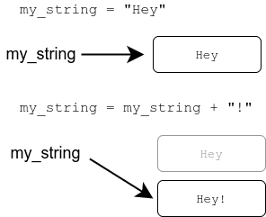
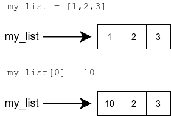
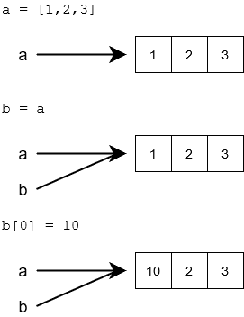

# References

<!--toc:start-->
- [References](#references)
  - [Learning objectives](#learning-objectives)
<!--toc:end-->

## Learning objectives

- Learn what a reference to a variable is.
- Understand that there can be multiple references to the same object.
- Use lists as parameters in functions.
- Learn what is a side effect of a function.

## Introduction

> [!NOTE]
> A variable does not stores a value, but its location in memory.

Until this point, we have assumed that a variable *stores* a value, but this
is not strictly true in python, what actually is stored in the variable is not
a value per se, but *a reference to the object* which is the actual value of
the variable; objects we have reviewed are strings, numbers and lists.

This means that the variable stores the information about the location in
computer memory where the value can be found. So, a reference tells us where the
value can be found. The function `id` can be used to find out the exact location
the variable points to:

```python

a = [1, 2, 3]
print(id(a)) # 4538357072
b = "This is a reference, too"
print(id(b)) # 4537788912

```

The ID or reference of the variable is an integer, this number can be thought of
as the address in memory for the value that the variable is referencing. The
references are represented by arrows.

Many of the builtin types in Python, such as `str`, are immutable. This means the
value of the object, or any part of it, cannot change. The value can be replaced
with a new value:



Some of Python types are mutable. For example, the contents of a list can change
without needing to create a whole new list:



## Multiple references to the same list

Since a list is a mutable type, if we assign a variable with a list to other
variable, we *copy* the reference to the new variable, which allows us to access
the same object from a different point:



The list can be accessed through either of the two references:

```python

list1 = [1, 2, 3, 4]
list2 = list1

list1[0] = 10
list2[1] = 20

print(list1) # [10, 20, 3, 4]
print(list2) # [10, 20, 3, 4]

```

> [!IMPORTANT]
> A change made through any one of the references affects also the other
references, as their target is the same.

## Coping a list

As a list is mutable, to actually copy a list we need to create a new one.
To achieve this we can use different methods, but the easier consists in
using the `[]` bracket operator since we are using lists.

> [!NOTE]
> The notation `[:]` selects **all elements** in the list.

We can use this method to create an independent copy of a list:

```python

my_list = [1,2,3,4]
new_list = my_list[:]

my_list[0] = 10
new_list[1] = 20

print(my_list) # [10, 2, 3, 4]
print(new_list) # [1, 20, 3, 4]

```

## Using lists as parameters in functions

When we pass a list as an argument to a function, we are using its reference,
which means the function can change the list itself.

The following function takes a list as an argument and adds a new item to the
end of the list:

```python

def add_item(my_list: list):
    new_item = 10
    my_list.append(new_item)

a_list = [1,2,3]
print(a_list) # [1, 2, 3]
add_item(a_list)
print(a_list) # [1, 2, 3, 10]

```

> [!IMPORTANT]
> The function does not return any value, it just modifies the list it take
as argument.

Another way to implement this functionality would be to create a new list
within the function, and return that:

```python

def add_item(my_list: list) -> list:
    new_item = 10
    my_list_copy = my_list[:]
    my_list_copy.append(new_item)
    return my_list_copy

numbers = [1, 2, 3]
numbers2 = add_item(numbers)

print("original list:", numbers) # original list: [1, 2, 3]
print("new list:", numbers2) # new list: [1, 2, 3, 10]

```

## Editing a list given as an argument

If inside a function we try yo assign a new list to the parameter list, wont work:

```python

def augment_all(my_list: list):
    new_list = []
    for item in my_list:
        new_list.append(item + 10)
    my_list = new_list

numbers = [1, 2, 3]
print("in the beginning:", numbers) # in the beginning: [1, 2, 3]
augment_all(numbers)
print("after the function is executed:", numbers)
# after the function is executed: [1, 2, 3]

```

The reason this happens is because this assignment has no effect outside the function,
so the original list, in the global frame, always is the same.
Furthermore, the variable `new_list`, which contains the new, augmented values,
is not accessible from outside the function. It is "lost" as the execution of the
function finishes, and focus returns to the main function. The variable `numbers`
in the main function always points to the original list.

One way to go over this would be by coping each item of the new created list
to the old list:

```python

def augment_all(my_list: list):
    new_list = []
    for item in my_list:
        new_list.append(item + 10)

    # copy items from the new list into the old list
    for i in range(len(my_list)):
        my_list[i] = new_list[i]

```

But also we can use list slicing to assign multiple item in a collection at once:

```python

>>> my_list = [1, 2, 3, 4]
>>> my_list[1:3] = [10, 20]
>>> my_list
[1, 10, 20, 4]

```

Or even, we can use the slice `[:]` to select all items and assign new values:

```python

>>> my_list = [1, 2, 3, 4]
>>> my_list[:] = [100, 99, 98, 97]
>>> my_list
[100, 99, 98, 97]

```

Therefore we can apply this principles to a new function which actually works correctly:

```python

def augment_all(my_list: list):
    new_list = []
    for item in my_list:
        new_list.append(item + 10)

    my_list[:] = new_list

```

> [!IMPORTANT]
> Inside a function the way we modify lists as parameters matters, is not the same
to assign `my_list = new_list` as `my_list[:] = new_list`.
In the first, the new list gets lost inside the function because the original
reference to that list is in the main global frame. The second uses slicing to
replace all items in the old list for the new ones created within the function.

Actually, there is no need to create a new list within the function at all. We can
just assign the new values directly into the original list:

```python

def augment_all(my_list: list):
    for i in range(len(my_list)):
        my_list[i] += 10

```

> [!NOTE]
> To actually change the original list which is passed as parameter in a function
we need to use slicing or some method which replaces the items, we cannot assign
an inside variable to the global variable.

## Coping nested lists

> [!IMPORTANT]
> To copy nested lists we can use the `[:]` but specifying what needs to be
copied.

When we have a nested list as a 2 dimensional array `nested = [[1,2],[3,4],[5,6,]]`
it's not enough to do the classic `my_list_copy = nested[:]` because this uses
the same reference to the original. To avoid this we need to get inside of
the original list and append each item separately:

```python

nested = [[1,2],[3,4],[5,6,]]
nested_copy = []
for item in nested:
  nested_copy.append(item[:])

```
